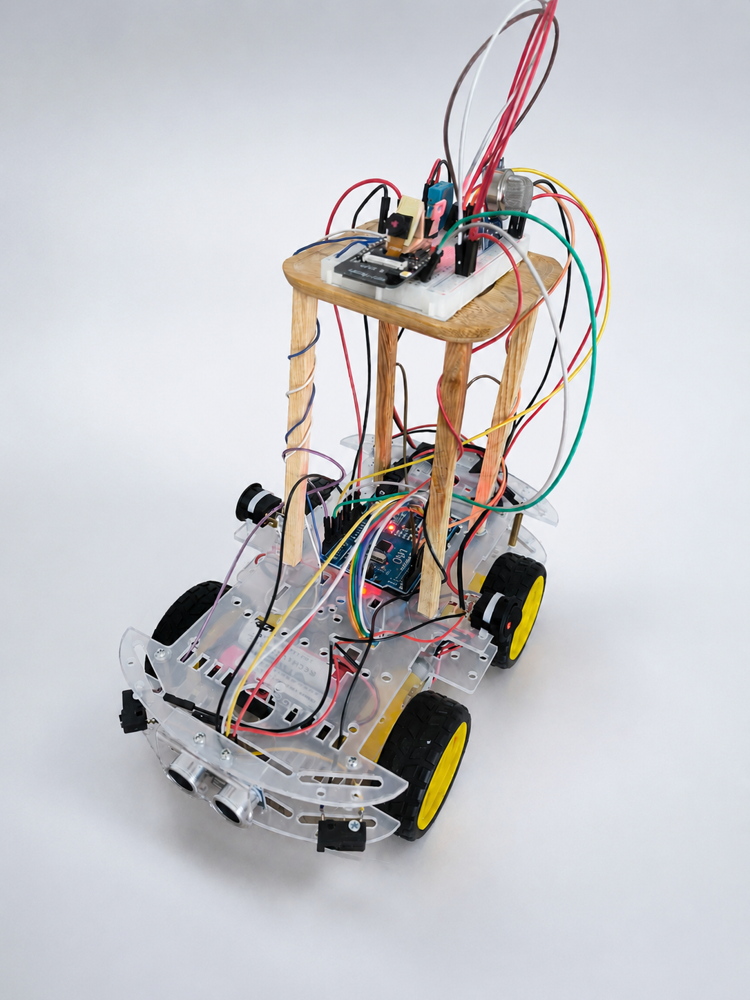

## Canlı Simülasyon

https://semihcanyildiz.github.io/OKB-Asistan-Robotu/

Bu simülasyon OKB Asistanı robotunun oda, mutfak ve salon görevlerini,
sensör verilerini ve yuvaya dönüş senaryolarını göstermektedir.

## Sistem Görseli

## Proje Tanıtım Videosu

Projenin çalışır durumdaki videosu aşağıdaki bağlantıdan izlenebilir:

https://youtu.be/gkV_Qgjs5V4

# OKB Asistanı Robotu

Telegram kontrollü mobil ev içi güvenlik ve izleme robotu.

## Özellikler

* Telegram üzerinden uzaktan kontrol
* ESP32-CAM ile fotoğraf gönderimi
* MQ2 gaz algılama sistemi
* DHT11 sıcaklık alarmı
* HC-SR04 engel algılama
* Encoder tabanlı navigasyon
* Otonom devriye sistemi

## Kullanılan Teknolojiler

* Arduino Uno
* ESP32-CAM
* Telegram Bot API
* UART Haberleşme
* PID Navigasyon

## Proje Amacı

OKB kaynaklı kontrol davranışlarını azaltmaya yardımcı olacak düşük maliyetli mobil yardımcı robot geliştirmek.
## Simülasyon

VS Code + Live Server kullanılarak çalıştırılabilir.

Komutlar:
- /mutfak
- /utu
- /salon
- /foto
- /dur
